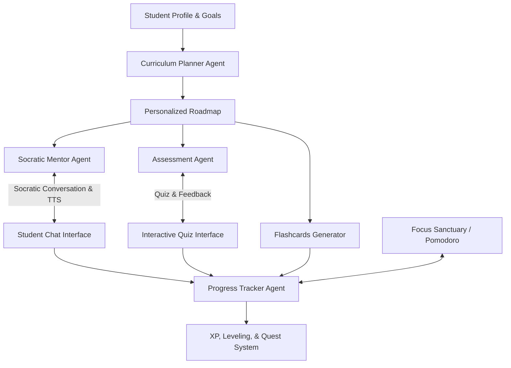

# Implementation Plan - EduMentor AI: A Multi-Agent Personalized Learning Assistant

EduMentor AI is a multi-agent personalized learning assistant designed to address key gaps in modern education. By structuring the learning process around specialized agents (Curriculum Planner, Socratic Mentor, Assessment & Feedback, and Progress Tracker), it helps students learn effectively rather than memorizing answers.

We will build a high-fidelity, premium Single Page Application (SPA) using HTML, CSS, and Vanilla JavaScript. The design will be extremely modern, utilizing a glassmorphic dark theme, sleek transitions, interactive charting, and real-time simulations of the multi-agent system.

---

## User Review Required

> [!IMPORTANT]
> **API Key & Simulation Strategy:** 
> To ensure the application is immediately usable and visually stunning, we will implement:
> 1. A built-in **Agent Simulation Engine** with pre-configured high-quality educational modules (e.g., *Intro to Python*, *Machine Learning Basics*, *Quantum Computing*, *World History*).
> 2. A **Gemini API Integration Option** in the settings. If the user provides a Gemini API key, the application will use the live Gemini API to generate custom courses, Socratic responses, and quizzes. If no API key is provided, the simulator will dynamically generate realistic educational materials.

Please review the proposed design palette, agent architecture, and expanded features below.

---

## Expanded Premium Features

1. **Multi-Agent Educational System:**
   - **Curriculum Planner:** Formulates a visual learning path (milestones, modules, lessons).
   - **Socratic Mentor:** Interactive chat partner that uses guiding questions to foster deep conceptual understanding rather than feeding answers.
   - **Assessment Agent:** Dynamic quiz arena with detailed conceptual breakdown for every response.
   - **Progress Tracker:** Dashboard of analytics, mastery levels, and visual metrics.

2. **Gamified Quest & XP System (NEW):**
   - **Daily Quests:** Dynamic daily challenges (e.g., *"Finish 1 lesson"*, *"Achieve a 3-turn Socratic streak"*).
   - **XP Progression:** Earn XP for completing lessons, passing quizzes, and interacting with agents. Level up with vibrant celebration animations.
   - **Badge Cabinet:** Unlockable custom badges with beautiful glowing SVGs (e.g., *"Socratic Disciple"*, *"Master Planner"*, *"Quantum Leaper"*).

3. **Spaced Repetition Flashcards (NEW):**
   - Dynamic flashcard generator based on the concepts learned in lessons.
   - Flipping cards with elegant 3D CSS transform animations.
   - Leitner-based grading system ("Need Review", "Hard", "Good", "Easy") to optimize retention.

4. **Focus Sanctuary & Ambient Soundscape (NEW):**
   - Deep focus mode overlay that hides distractions.
   - Built-in customizable **Pomodoro Timer** with beautiful concentric progress rings.
   - Audio ambient tracks: Lo-Fi Study Beats, Gentle Rain, Forest Streams, and Synthwave. (Uses HTML5 synthesis/oscillators or ambient loops).

5. **Audio Synthesis Reader (NEW):**
   - Text-to-Speech (TTS) integration using the Web Speech API to read out Socratic messages and lesson summaries, aiding auditory learners.

---

## Proposed System Architecture



---

## Proposed Changes

We will create a self-contained, high-performance web app with the following structure:

```
capstone/
├── index.html            # Main entry point, sidebar navigation, view wrappers
├── index.css             # Premium CSS system (Glassmorphism, animations, dark mode)
├── app.js                # Router, state management, and UI logic
├── agent-engine.js       # Live Gemini API client and offline simulation engine
└── README.md             # Documentation on how to run and use the project
```

### Files to Create

#### [NEW] [index.html](file:///c:/Users/sharanya/OneDrive/Desktop/capstone/index.html)
- Main single-page application structure.
- Sidebar with links: Dashboard, Curriculum Planner, Socratic Mentor, Flashcards, Focus Sanctuary, Quiz Arena, Progress Analytics, Settings.
- Content container that swaps view panels smoothly with transition animations.
- Custom templates for course cards, chat messages, quiz questions, flashcards, and badges.

#### [NEW] [index.css](file:///c:/Users/sharanya/OneDrive/Desktop/capstone/index.css)
- Premium dark mode palette:
  - Deep space background (`#0b0f19`)
  - Accent colors: Electric Cyan (`#06b6d4`), Neon Violet (`#8b5cf6`), Emerald Mint (`#10b981`), Radiant Amber (`#f59e0b`)
  - Glassmorphic panels with border-gradients, backdrops-filters, and soft drop shadows.
- Elegant custom animations: pulse, fade-in-up, floating particles, card flipping, typing indicators, and slide transitions.
- Responsive styles optimized for desktop, tablet, and mobile.

#### [NEW] [app.js](file:///c:/Users/sharanya/OneDrive/Desktop/capstone/app.js)
- Application state manager: tracks active courses, progress metrics, XP, current level, completed quests, active flashcard decks, and settings.
- View controller: manages route/tab swapping and updates DOM content based on the active state.
- Form handlers for generating a learning path, typing Socratic prompts, and taking quizzes.
- Pomodoro timer interval control and Web Audio API synthesizer for ambient background focus noise.

#### [NEW] [agent-engine.js](file:///c:/Users/sharanya/OneDrive/Desktop/capstone/agent-engine.js)
- Core logic for simulation and Gemini API integration.
- Standard Prompt templates for Gemini:
  - Generating structured JSON roadmap modules.
  - Acting as a Socratic tutor (restricting responses to hints/guiding questions).
  - Creating multiple-choice questions with educational explanations.
  - Generating key conceptual flashcards from text.
- Offline simulation fallbacks containing rich content databases for Python, ML, Quantum Computing, and History to ensure offline users have a top-tier experience.

#### [NEW] [README.md](file:///c:/Users/sharanya/OneDrive/Desktop/capstone/README.md)
- Overview of the system.
- Instructions on how to launch the local web server.
- Guide on setting up a Gemini API Key to unlock real-time live generations.

---

## Verification Plan

### Manual Verification
1. **Local Server Launch:** Start a lightweight local server and verify the page loads.
2. **Tab Navigation:** Test switching between all 7 tabs. Ensure CSS transitions are smooth and glassmorphic layouts render correctly.
3. **Curriculum Generation (Offline):** Run a simulation generation for "Intro to Python". Check if the course timeline builds with sub-lessons.
4. **Socratic Conversation:** Start a chat about "Variables". Verify that the bot guides the student with questions rather than just outputting the code. Check Speech Synthesis reads the text when audio button is clicked.
5. **Flashcard interaction:** Verify flashcards generate based on selected lesson, flip on click, and Leitner actions update card queues.
6. **Focus Sanctuary:** Start Pomodoro timer, verify the circle counts down correctly, and try toggling the white-noise synthesizer or lo-fi audio simulator.
7. **Quiz Experience:** Complete a quiz, verify scoring, conceptual explanations, XP gain, level up, and quest completions.
